ClickGuard is an auto clicker mod for Fabric that lets you automate clicking any keybind, even keybinds from other mods.
It includes smart AFK-safety features:
automatic stopping, system notifications, and automatic disconnecting in the following scenarios:

- On damage
- At a specific health level
- At a specific hunger level
- At a specific weapon durability
- After a specific time of the auto clicker not clicking because of filters

The mod also lets you only click on entities, blocks or both.

## Installation

This mod is only supported by the Fabric mod loader. For installation guides regarding Fabric itself please, use the
official [Fabric player guides](https://docs.fabricmc.net/players/).

You can download the mod from either [Modrinth](https://modrinth.com/mod/clickguard),
[CurseForge](https://www.curseforge.com/minecraft/mc-mods/clickguard) or
on [GitHub](https://github.com/Pr77Pr77/clickguard)
under [releases](https://github.com/Pr77Pr77/clickguard/releases).

This mod has the following dependencies:

- Required: [Fabric API](https://modrinth.com/mod/fabric-api)
- Optional: [Mod Menu](https://modrinth.com/mod/modmenu)

## Using the mod

To use the mod, you need to create a preset first. To create a preset, press the assigned keybind for "Open ClickGuard's
presets menu", which defaults to `,`.

After creating your presets, simply enable them from the same presets menu by clicking on "OFF". The preset is now
enabled, but for it to actually start clicking, you need to either click on the
"Start clicking" button or press `.` while in-game.

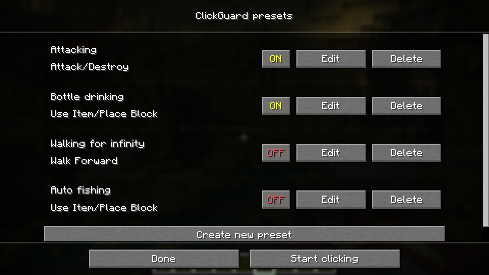
*The presets menu with some example presets*

A HUD will tell you that the auto clicker is enabled and which presets are enabled:

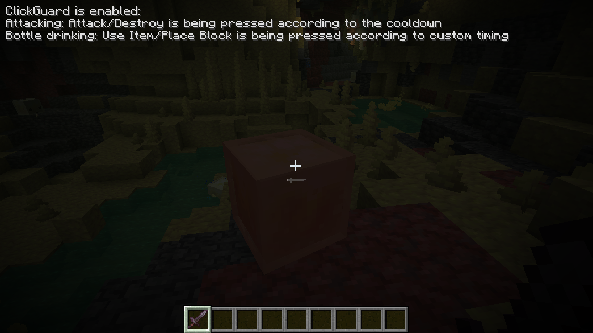
*The HUD showing active presets while the auto clicker is enabled*

> Please note that this mod is not allowed on some servers. I recommend reading the rules
> of the server you want to use this mod on.
> I accept no liability for any damages caused by using this mod. Use at your own risk!

## Configuring presets (Feature explanation)

When creating a preset, you are asked to choose a keybind before configuring anything else. After choosing the keybind,
you can proceed to configure the other options:

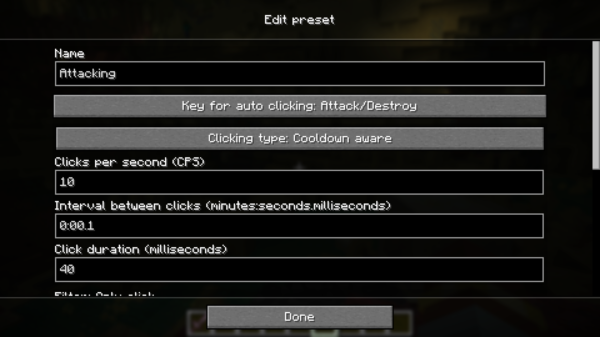
*The screen to edit a preset*

### Name

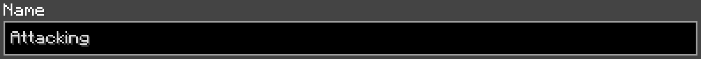

The name of the preset. This is just for you to tell presets apart in the presets menu, the HUD and the screen after
automatically disconnecting.

### Key for auto clicking

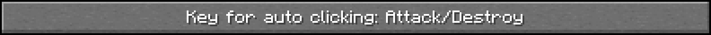

By clicking on this button, you can change the keybind which should be pressed by the auto clicker.

### Clicking type and custom timings

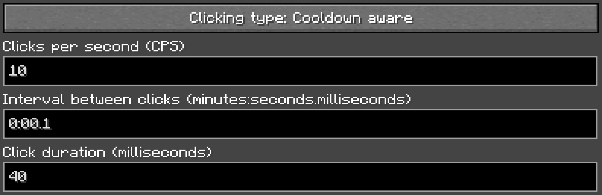

By clicking on the button "Clicking type", you can cycle through the following types of clicking:

- Continuous: Presses a key continuously
- Custom timing: Presses the key according to the times set below
- Cooldown aware: Presses the key again as soon as the cooldown is over

The clicking speed and duration can only be set if "Custom timing" is selected. The "Clicks per second" and "Interval
between clicks" text fields set the clicking speed. This means that when one of the values is changed, the other will be
changed too. You can just enter the timing in your preferred unit. The "Click duration" text field can be used to set
the duration of the automatically performed click. The value has to be less than the clicking interval.

### Filters

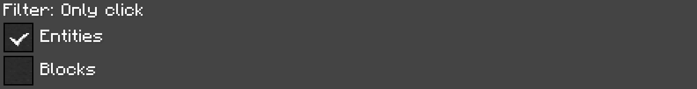

Filters let the auto clicker only click if an entity or a block is within your reach. If both "Entities" and "Blocks"
are selected, the auto clicker will only click if something is within reach. If nothing is selected, the auto clicker
will click, even if there is nothing in your reach. This setting doesn't affect other presets.

### Handling of actions

There are multiple "actions" getting checked by the mod. Every action can result in multiple of the following reactions:

- Stop auto clicker: This stops the entire auto clicker, even other presets.
- Notification: This sends a system notification. The appearance differs between OSes. Notifications are not tested for
  macOS.
- Leave world: This leaves the current world or server and displays this screen with information about it:

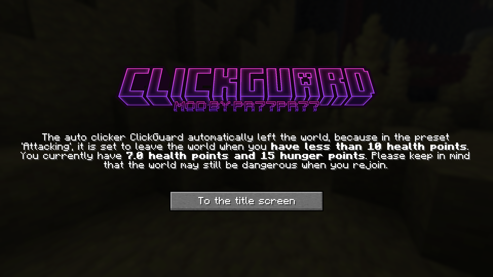
*The screen shown after the mod automatically disconnects from the server or world.*

#### On damage

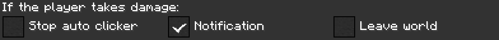

This action's reactions are executed as soon as you take any damage. The reactions can be configured as described above.

#### At specific health levels

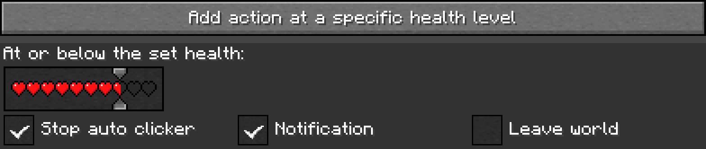

For this type of action, there can be multiple of the same type. To create an action, click on the button "Add action at
a specific health level". With the slider featuring hearts, you can set the health threshold at or below which the
reactions will trigger.

#### At specific hunger levels

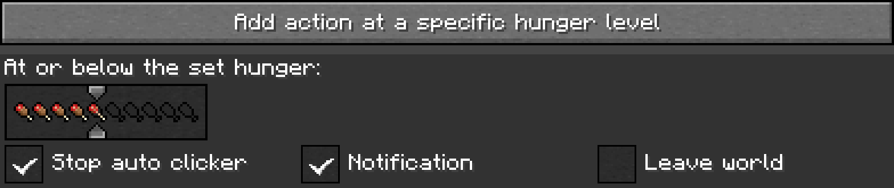

This action type works exactly like the actions for specific health levels, just with hunger instead of health.

#### At specific durability of the weapon

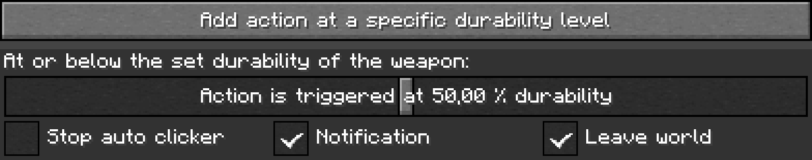

Actions of the durability type can be created with a click on the button
"Add action at a specific durability level". With the slider, you can set the durability level at or below which the
selected reactions should be triggered.

#### After the auto clicker did not perform a click

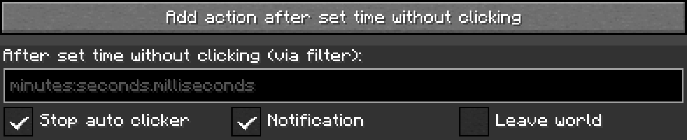

These actions are also created by clicking on the button labeled
"Add action after set time without clicking". In the text box, you can enter the time after which you want the reactions
to be triggered if the auto clicker did not perform a click. The auto clicker not performing a click can be due to
filters. This option does not take other presets into account for the wait time, but reactions can have an impact on
other presets.

## Reporting issues, getting help and suggesting features

If you have trouble using the mod, if you stumble upon a bug, if you want to suggest a feature to be implemented or if
you would like to have a backport of the mod, please don't hesitate to post
an [issue on GitHub](https://github.com/Pr77Pr77/clickguard/issues)
or open a ticket on the [Discord server](https://discord.gg/wfeM63Jar5). I will try to respond as soon as possible and
maybe ask follow-up questions.